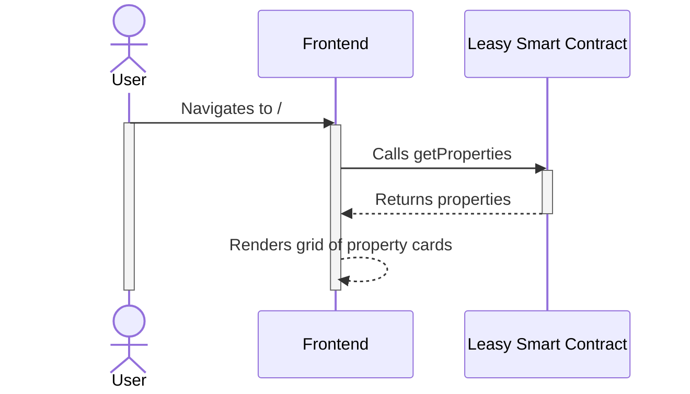
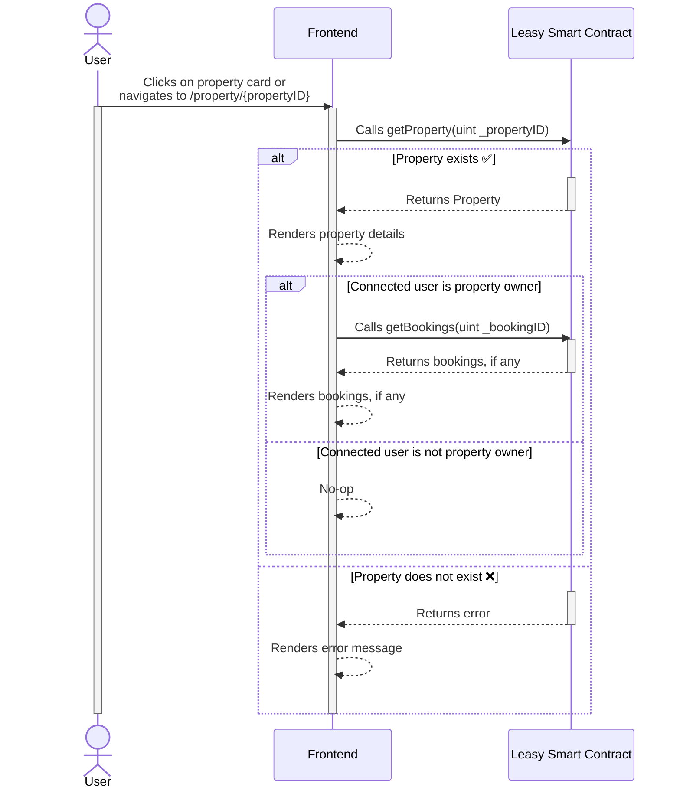

# Flows

## List all properties

```mermaid
sequenceDiagram
    actor U as User
    participant F as Frontend
    participant L as Leasy Smart Contract

    U ->> F: Navigates to /
    activate U
    activate F

    F ->> L: Calls getProperties
        activate L
        L -->> F: Returns properties
        deactivate L
    F -->> F: Renders grid of property cards

    deactivate F
    deactivate U
```

## Get property details

```mermaid
sequenceDiagram
    actor U as User
    participant F as Frontend
    participant L as Leasy Smart Contract

    U ->> F: Clicks on property card or<br/>navigates to /property/{propertyID}
    activate U
    activate F

    F ->> L: Calls getProperty(uint _propertyID)

        alt Property exists ✅
            activate L
            L -->> F: Returns Property
            deactivate L
            
            F -->> F: Renders property details

            alt Connected user is property owner
                F ->> L: Calls getBookings(uint _bookingID)
                activate L
                L -->> F: Returns bookings, if any
                deactivate L
                F -->> F: Renders bookings, if any
            else Connected user is not property owner
                F -->> F: No-op
            end

        else Property does not exist ❌
            activate L
            L -->> F: Returns error
            deactivate L

            F -->> F: Renders error message
        end

    deactivate F
    deactivate U
```
