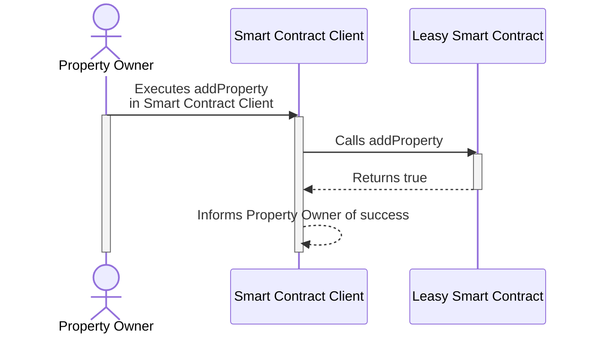

# Add property

```mermaid
sequenceDiagram
    actor U as Property Owner
    participant F as Smart Contract Client
    participant L as Leasy Smart Contract

    U ->> F: Executes addProperty<br/>in Smart Contract Client
    activate U
    activate F

    F ->> L: Calls addProperty
        activate L
        L -->> F: Returns true
        deactivate L
    F -->> F: Informs Property Owner of success

    deactivate F
    deactivate U
```

