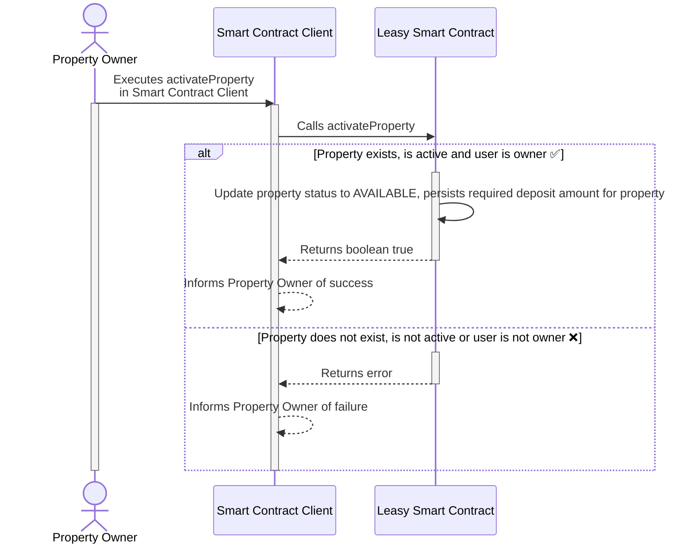

# Activate property

```mermaid
sequenceDiagram
    actor U as Property Owner
    participant F as Smart Contract Client
    participant L as Leasy Smart Contract

    U ->> F: Executes activateProperty<br/>in Smart Contract Client
    activate U
    activate F

    F ->> L: Calls activateProperty
        alt Property exists, is active and user is owner ✅
            activate L
            L ->> L: Update property status to AVAILABLE, persists required deposit amount for property
            L -->> F: Returns boolean true
            deactivate L

            F -->> F: Informs Property Owner of success

        else Property does not exist, is not active or user is not owner ❌
            activate L
            L -->> F: Returns error
            deactivate L

            F -->> F: Informs Property Owner of failure
        end

    deactivate F
    deactivate U
```

