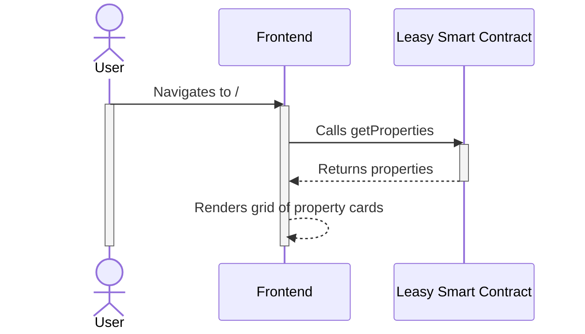

# List all properties end-to-end flow

```mermaid
sequenceDiagram
    actor U as User
    participant F as Frontend
    participant L as Leasy Smart Contract

    U ->> F: Navigates to /
    activate U
    activate F

    F ->> L: Calls getProperties
        activate L
        L -->> F: Returns properties
        deactivate L
    F -->> F: Renders grid of property cards

    deactivate F
    deactivate U
```

