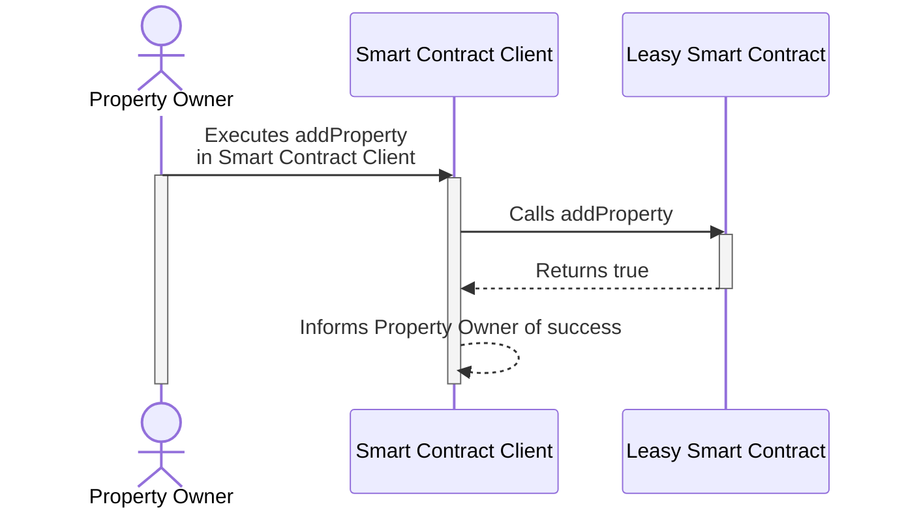
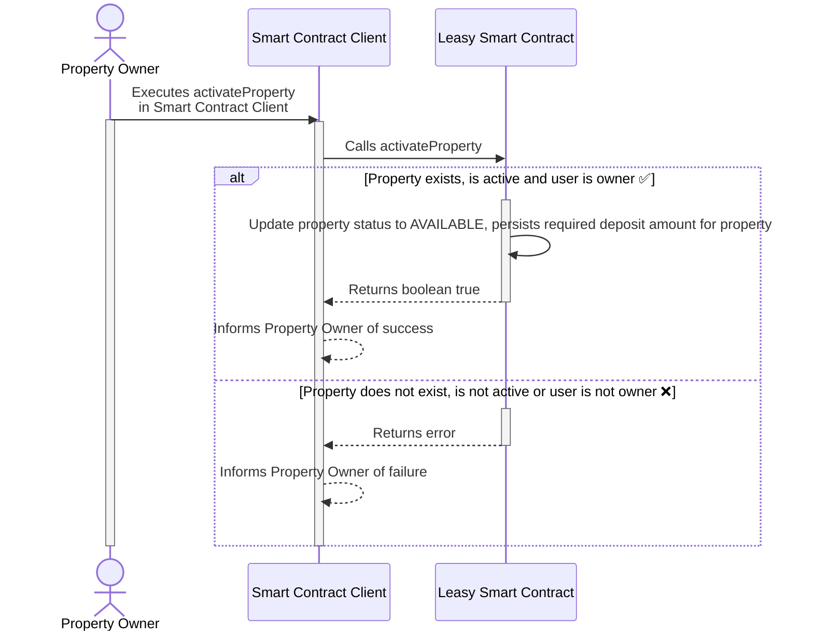
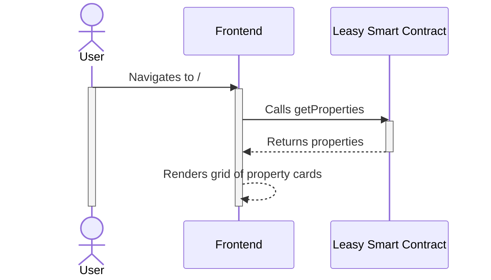
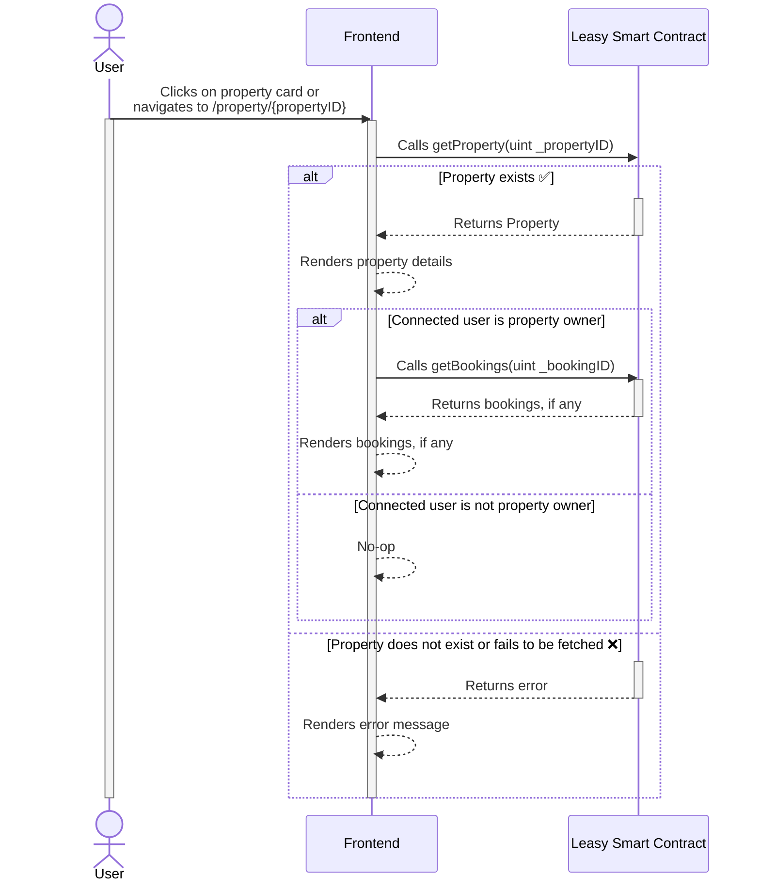

# Flows & Components

## Add property

```mermaid
sequenceDiagram
    actor U as Property Owner
    participant F as Smart Contract Client
    participant L as Leasy Smart Contract

    U ->> F: Executes addProperty<br/>in Smart Contract Client
    activate U
    activate F

    F ->> L: Calls addProperty
        activate L
        L -->> F: Returns true
        deactivate L
    F -->> F: Informs Property Owner of success

    deactivate F
    deactivate U
```

## Activate property

```mermaid
sequenceDiagram
    actor U as Property Owner
    participant F as Smart Contract Client
    participant L as Leasy Smart Contract

    U ->> F: Executes activateProperty<br/>in Smart Contract Client
    activate U
    activate F

    F ->> L: Calls activateProperty
        alt Property exists, is active and user is owner ✅
            activate L
            L ->> L: Update property status to AVAILABLE, persists required deposit amount for property
            L -->> F: Returns boolean true
            deactivate L

            F -->> F: Informs Property Owner of success

        else Property does not exist, is not active or user is not owner ❌
            activate L
            L -->> F: Returns error
            deactivate L

            F -->> F: Informs Property Owner of failure
        end

    deactivate F
    deactivate U
```

## List all properties end-to-end flow

```mermaid
sequenceDiagram
    actor U as User
    participant F as Frontend
    participant L as Leasy Smart Contract

    U ->> F: Navigates to /
    activate U
    activate F

    F ->> L: Calls getProperties
        activate L
        L -->> F: Returns properties
        deactivate L
    F -->> F: Renders grid of property cards

    deactivate F
    deactivate U
```

## Get property details end-to-end flow

```mermaid
sequenceDiagram
    actor U as User
    participant F as Frontend
    participant L as Leasy Smart Contract

    U ->> F: Clicks on property card or<br/>navigates to /property/{propertyID}
    activate U
    activate F

    F ->> L: Calls getProperty(uint _propertyID)

        alt Property exists ✅
            activate L
            L -->> F: Returns Property
            deactivate L
            
            F -->> F: Renders property details

            alt Connected user is property owner
                F ->> L: Calls getBookings(uint _bookingID)
                activate L
                L -->> F: Returns bookings, if any
                deactivate L
                F -->> F: Renders bookings, if any
            else Connected user is not property owner
                F -->> F: No-op
            end

        else Property does not exist or fails to be fetched ❌
            activate L
            L -->> F: Returns error
            deactivate L

            F -->> F: Renders error message
        end

    deactivate F
    deactivate U
```

