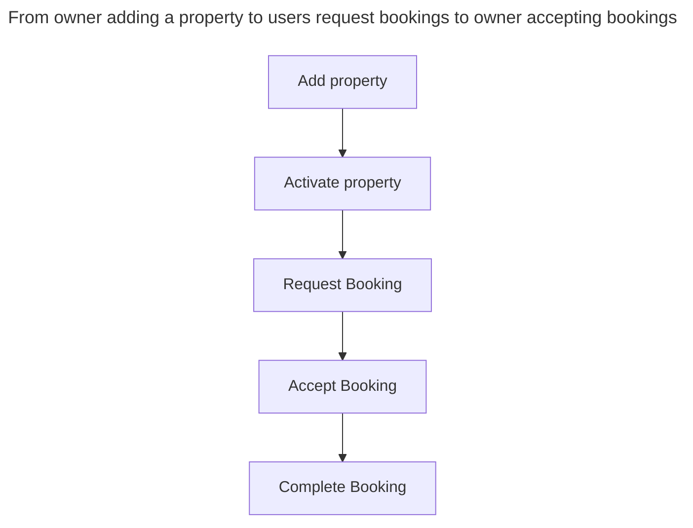
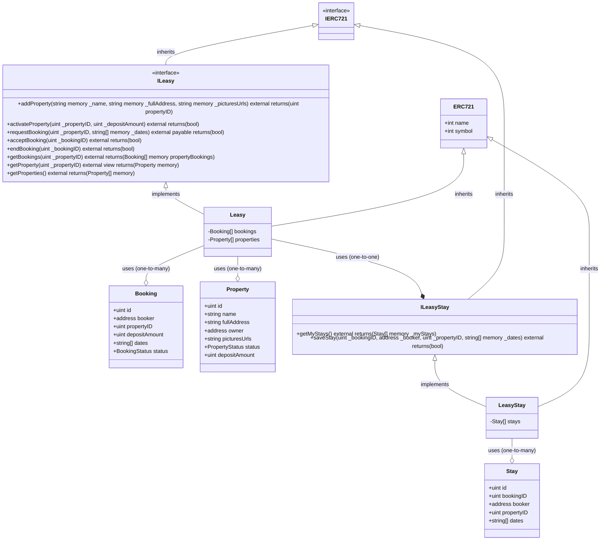

# Components and Flow

## Flow

```mermaid
---
title: From owner adding a property to users request bookings to owner accepting bookings
---
flowchart
    A[Add property] --> B[Activate property]
    B --> C[Request Booking]
    C --> D[Accept Booking]
    D --> E[Complete Booking]
```

## Leasy Contract Components

```mermaid
classDiagram
    class IERC721
    <<interface>> IERC721

    class ILeasy {
        +addProperty(string memory _name, string memory _fullAddress, string memory _picturesUrls) external returns (uint propertyID)
        +activateProperty(uint _propertyID, uint _depositAmount) external returns (bool)
        +requestBooking(uint _propertyID, string[] memory _dates) external payable returns (bool)
        +acceptBooking(uint _bookingID) external returns (bool)
        +endBooking(uint _bookingID) external returns (bool)
        +getBookings(uint _propertyID) external returns (Booking[] memory propertyBookings)
        +getProperty(uint _propertyID) external view returns (Property memory)
        +getProperties() external returns (Property[] memory)
    }
    <<interface>> ILeasy

    class ERC721 {
        +int name
        +int symbol
    }

    class Leasy {
        -Booking[] bookings
        -Property[] properties
    }

    class Booking {
        +uint id
        +address booker
        +uint propertyID
        +uint depositAmount
        +string[] dates
        +BookingStatus status
    }

    class Property {
        +uint id
        +string name
        +string fullAddress
        +address owner
        +string picturesUrls
        +PropertyStatus status
        +uint depositAmount
    }

    class ILeasyStay {
        +getMyStays() external returns (Stay[] memory _myStays)
        +saveStay(uint _bookingID, address _booker, uint _propertyID, string[] memory _dates) external returns (bool)
    }
    <<interface>> ILeasy

    class LeasyStay {
        -Stay[] stays
    }

    class Stay {
        +uint id
        +uint bookingID
        +address booker
        +uint propertyID
        +string[] dates
    }

    IERC721 <|-- ILeasy : inherits
    ILeasy <|-- Leasy : implements
    ERC721 <|-- Leasy : inherits
    Leasy --o Booking : uses (one-to-many)
    Leasy --o Property : uses (one-to-many)
    Leasy --* ILeasyStay : uses (one-to-one)

    IERC721 <|-- ILeasyStay : inherits
    ILeasyStay <|-- LeasyStay : implements
    ERC721 <|-- LeasyStay : inherits
    LeasyStay --o Stay : uses (one-to-many)
```

